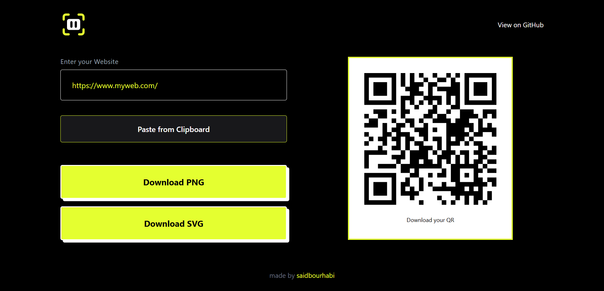

# 📱 QR-Boot

**QR-Boot** is a fast, modern, and free QR Code generator. Paste any URL or text, and instantly download your QR Code as PNG or SVG. Built for developers and designers who need clean, high‑quality QR codes in seconds.

🔗 **Live Demo**: [https://qr-boot.vercel.app/](https://qr-boot.vercel.app/)


---

## 📸 Screenshot



---

## ✨ Features

- ⚡ **Instant generation** – paste a URL or text and see the QR code appear in real‑time
- 📥 **Download as PNG or SVG** – export your QR code in high quality for any use case
- 📋 **Paste from clipboard** – one‑click paste for super fast workflow
- 🎨 **Clean, minimal UI** – built with Tailwind CSS for a polished experience
- 🔔 **Toast notifications** – instant feedback when you copy or download
- 📱 **Fully responsive** – works perfectly on desktop, tablet, and mobile
- 📊 **Privacy‑first analytics** – uses Plausible for lightweight, cookieless tracking

---

## 🛠️ Tech Stack

| Category | Tools |
|----------|-------|
| **Frontend** | React 19, React Router DOM 7 |
| **Build Tool** | Vite 8 |
| **Styling** | Tailwind CSS 4 + @tailwindcss/vite |
| **QR Generation** | qrcode, react-qr-code |
| **Notifications** | react-hot-toast |
| **Analytics** | @vercel/analytics, @plausible-analytics/tracker |
| **SEO** | react-helmet-async |
| **Code Quality** | ESLint |
| **Deployment** | Vercel |

---

## 📦 Installation

Clone the repository and install dependencies:

```bash
git clone https://github.com/Saidbourhabi/qr-boot.git
cd qr-boot/qr-boot
npm install